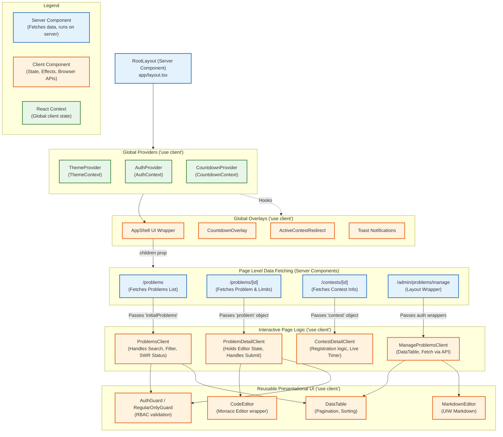

```mermaid
flowchart TD
    %% Define Styles for Server vs Client
    classDef server fill:#e3f2fd,stroke:#1565c0,stroke-width:2px;
    classDef client fill:#fff3e0,stroke:#e65100,stroke-width:2px;
    classDef context fill:#e8f5e9,stroke:#2e7d32,stroke-width:2px;
    classDef generic fill:#f5f5f5,stroke:#9e9e9e,stroke-width:1px;

    %% Root Layout
    RootLayout["RootLayout (Server Component)<br/>app/layout.tsx"]:::server
    
    %% Context Providers (Client bounds)
    subgraph GlobalProviders ["Global Providers ('use client')"]
      direction TB
      ThemeProvider["ThemeProvider<br/>(ThemeContext)"]:::context
      AuthProvider["AuthProvider<br/>(AuthContext)"]:::context
      CountdownProvider["CountdownProvider<br/>(CountdownContext)"]:::context
    end

    %% Global Client Overlays
    subgraph GlobalOverlays ["Global Overlays ('use client')"]
      direction TB
      AppShell["AppShell UI Wrapper"]:::client
      CountdownOverlay["CountdownOverlay"]:::client
      ActiveContestRedirect["ActiveContestRedirect"]:::client
      ToastContainer["Toast Notifications"]:::client
    end

    %% Key Page Examples (Server fetching Data)
    subgraph ServerPages ["Page Level Data Fetching (Server Components)"]
      direction TB
      PageProblemsList["/problems<br/>(Fetches Problems List)"]:::server
      PageProblemDetail["/problems/[id]<br/>(Fetches Problem & Limits)"]:::server
      PageContestDetail["/contests/[id]<br/>(Fetches Contest Info)"]:::server
      PageAdminManage["/admin/problems/manage<br/>(Layout Wrapper)"]:::server
    end

    %% Key Client Handlers managing Interactive State
    subgraph ClientPages ["Interactive Page Logic ('use client')"]
      direction TB
      ProblemsClient["ProblemsClient<br/>(Handles Search, Filter, SWR Status)"]:::client
      ProblemDetailClient["ProblemDetailClient<br/>(Holds Editor State, Handles Submit)"]:::client
      ContestDetailClient["ContestDetailClient<br/>(Registration logic, Live Timer)"]:::client
      AdminManageClient["ManageProblemsClient<br/>(DataTable, Fetch via API)"]:::client
    end

    %% Leaf UI Components
    subgraph Components ["Reusable Presentational UI ('use client')"]
      direction TB
      CodeEditor["CodeEditor<br/>(Monaco Editor wrapper)"]:::client
      MarkdownEditor["MarkdownEditor<br/>(UIW Markdown)"]:::client
      DataTable["DataTable<br/>(Pagination, Sorting)"]:::client
      AuthGuard["AuthGuard / RegularOnlyGuard<br/>(RBAC validation)"]:::client
    end

    %% Connections - Layout mapping
    RootLayout --> GlobalProviders
    GlobalProviders --> AppShell
    GlobalProviders -.->|Hooks| GlobalOverlays

    %% Navigation tree
    AppShell -->|children prop| ServerPages
    
    %% Server to Client prop passing
    PageProblemsList -->|Passes 'initialProblems'| ProblemsClient
    PageProblemDetail -->|Passes 'problem' object| ProblemDetailClient
    PageContestDetail -->|Passes 'contest' object| ContestDetailClient
    PageAdminManage -->|Passes auth wrappers| AdminManageClient

    %% Client components rendering leaf UI
    ProblemsClient --> AuthGuard
    ProblemsClient --> DataTable
    
    ProblemDetailClient --> CodeEditor
    ProblemDetailClient --> AuthGuard

    AdminManageClient --> DataTable
    AdminManageClient --> MarkdownEditor

    %% Documentation keys
    subgraph Legend
      L_Server["Server Component<br/>(Fetches data, runs on server)"]:::server
      L_Client["Client Component<br/>(State, Effects, Browser APIs)"]:::client
      L_Context["React Context<br/>(Global client state)"]:::context
    end
```