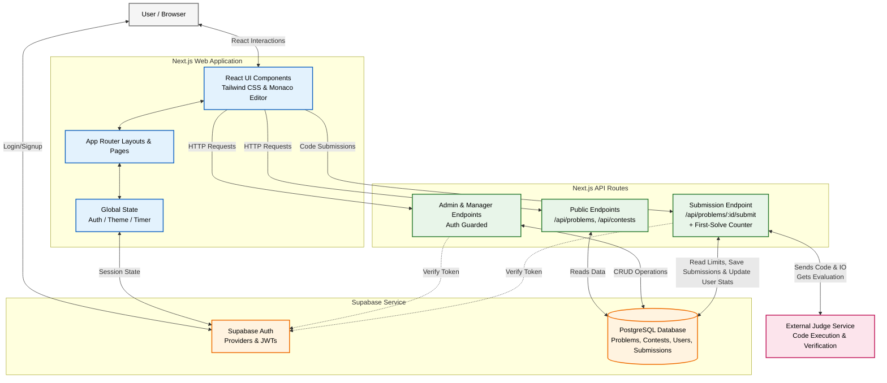

```mermaid
flowchart TD
    %% Define styles for different layers
    classDef frontend fill:#E3F2FD,stroke:#1565C0,stroke-width:2px,color:#000
    classDef backend fill:#E8F5E9,stroke:#2E7D32,stroke-width:2px,color:#000
    classDef database fill:#FFF3E0,stroke:#EF6C00,stroke-width:2px,color:#000
    classDef external fill:#FCE4EC,stroke:#C2185B,stroke-width:2px,color:#000
    classDef user fill:#F5F5F5,stroke:#757575,stroke-width:2px,color:#000

    %% Client/User Layer
    User[User / Browser]:::user

    %% Next.js Frontend Layer
    subgraph Frontend [Next.js Web Application]
        direction TB
        UI[React UI Components<br/>Tailwind CSS & Monaco Editor]:::frontend
        Layouts[App Router Layouts & Pages]:::frontend
        Contexts[Global State<br/>Auth / Theme / Timer]:::frontend
    end

    %% Next.js API Layer
    subgraph API [Next.js API Routes]
        direction TB
        PublicAPI[Public Endpoints<br/>/api/problems, /api/contests]:::backend
        AdminAPI[Admin & Manager Endpoints<br/>Auth Guarded]:::backend
        SubmitAPI[Submission Endpoint<br/>/api/problems/:id/submit<br/>+ First-Solve Counter]:::backend
    end

    %% Database & Auth Layer
    subgraph SupabaseDB [Supabase Service]
        direction TB
        Auth[Supabase Auth<br/>Providers & JWTs]:::database
        DB[(PostgreSQL Database<br/>Problems, Contests, Users, Submissions)]:::database
    end

    %% External Evaluation Service
    Judge[External Judge Service<br/>Code Execution & Verification]:::external

    %% Connections
    User <-->|React Interactions| UI
    UI <--> Layouts
    Layouts <--> Contexts

    %% Frontend to API logic / Server Actions
    UI -->|HTTP Requests| PublicAPI
    UI -->|HTTP Requests| AdminAPI
    UI -->|Code Submissions| SubmitAPI

    %% Backend to Database 
    PublicAPI <-->|Reads Data| DB
    AdminAPI <-->|CRUD Operations| DB
    SubmitAPI <-->|Read Limits, Save Submissions & Update User Stats| DB

    %% Auth interactions
    User <-->|Login/Signup| Auth
    Contexts <-->|Session State| Auth
    AdminAPI -.->|Verify Token| Auth
    SubmitAPI -.->|Verify Token| Auth

    %% Submission flow
    SubmitAPI <-->|Sends Code & IO<br/>Gets Evaluation| Judge
```