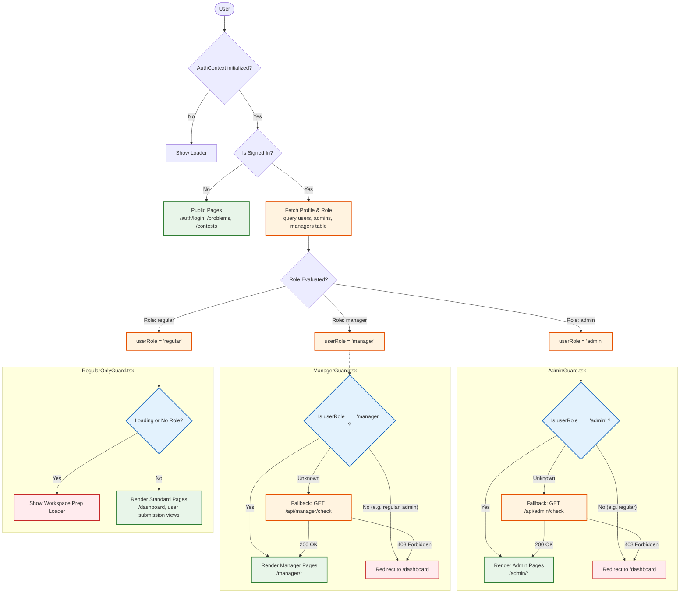

# Role-Based Access Control (RBAC) Flow

## Authentication & Guard Flowchart

The following flowchart illustrates how varying user levels authenticate, how roles are fetched, and how the `*Guard` components route traffic across the application.

## Permissions Matrix

This matrix formalizes what each user role is permitted to do across the application. Handled implicitly via UI layout masking and explicitly via API/Guard validation.

| Feature / Action | Guest (Unauthenticated) | Regular User | Manager | Admin |
| :--- | :---: | :---: | :---: | :---: |
| **View Public Problems List** | ✅ | ✅ | ✅ | ✅ |
| **View Public Contests List** | ✅ | ✅ | ✅ | ✅ |
| **Authenticate (Login/Sign Up)** | ✅ | ❌ (Redirected) | ❌ (Redirected) | ❌ (Redirected) |
| **Submit Code (`/api/problems/:id/submit`)** | ❌ (AuthPrompt) | ✅ | ✅ | ✅ |
| **Join Active Contests** | ❌ | ✅ | ✅ | ✅ |
| **View User Dashboard** | ❌ | ✅ | ✅ | ✅ |
| **View Manager Dashboard** | ❌ | ❌ | ✅ | ❌ |
| **Create/Manage Specific Contests** | ❌ | ❌ | ✅ | ✅ (All Contests) |
| **Create/Manage Specific Problems** | ❌ | ❌ | ✅ | ✅ (All Problems) |
| **View ALL User Submissions** | ❌ | ❌ | ✅ (Limited to scoped users) | ✅ (Unrestricted) |
| **Use C++ Test Generator** | ❌ | ❌ | ✅ | ✅ |
| **Generate/Access System Audits** | ❌ | ❌ | ❌ | ✅ |