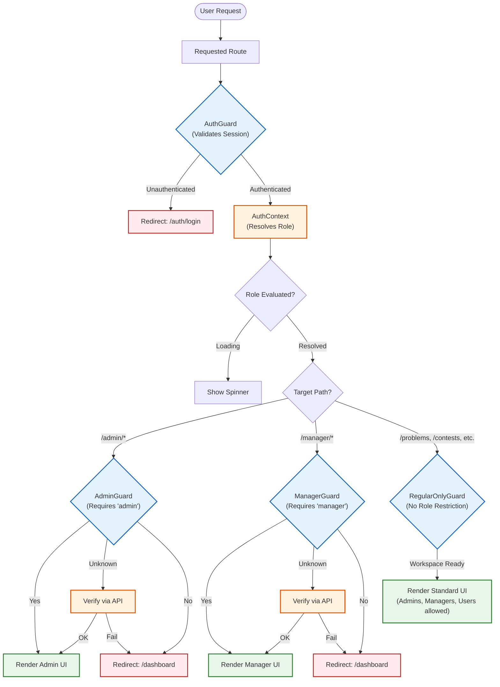

# Role-Based Access Control (RBAC) Flow

## Authentication & Guard Flowchart

The following flowchart illustrates how varying user levels authenticate, how roles are fetched, and how the `*Guard` components route traffic across the application.

